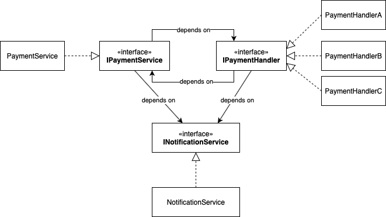

# Runtime Circular Dependency Injection

This shows an example of a circular dependency that can be resolved using runtime resolution.

## The Payment Service

In this example `IPaymentService` depends on several `IPaymentHandler`s to process payments.
For example, when a bank receives a payment, it could trigger a series of actions at once.

This is very similar to a single publisher + multiple subscriber design.

## The Payment Handler

Then `IPaymentHandler` also depends on `IPaymentService`. For example, one of these actions
may require a further deduction of a processing fee handled by the same service. (This is just
a hypothetical example.)

This is becomes a circular dependency.

The solution to this is to resolve one of these services at runtime. In this example,
`IPaymentHandler` is resolved at runtime within `IPaymentService.Capture()`.

### License

Copyright 2020, [Justin Lee](https://tzlee.com/).
Released under the [MIT License](LICENSE).
